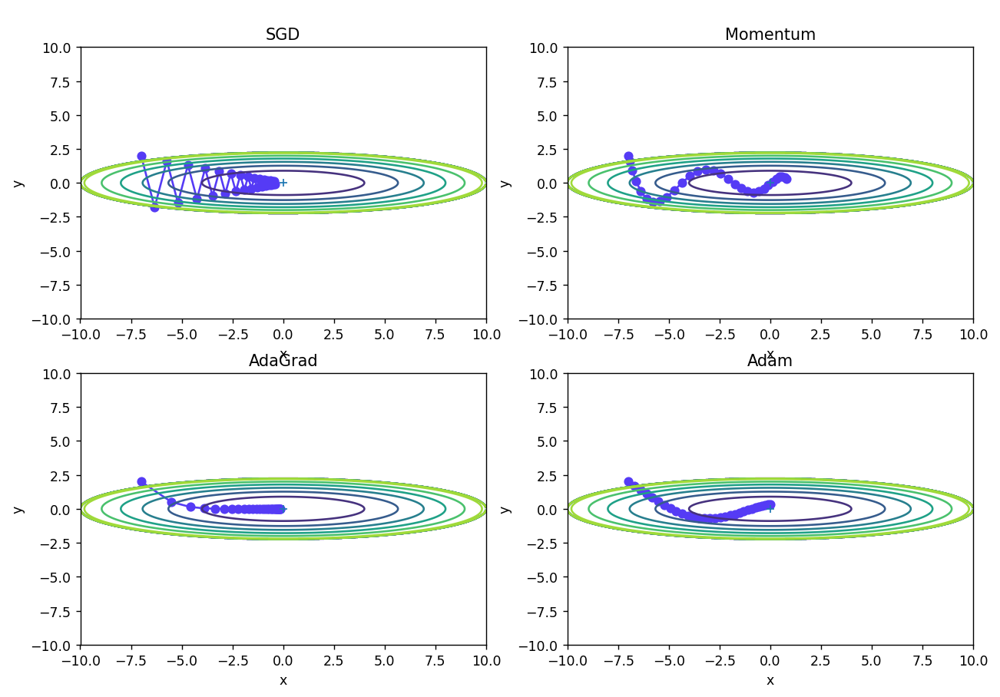

多种深度学习优化器最优化梯度更新路径图的绘制。

<!--more-->

本文对深度学习中SGD、Momentum、AdaGrad、Adam四种优化器进行了最优化梯度更新路径图的对比绘制，将介绍Python和MATLAB两种代码实现方式。

# PYTHON实现方法

1.  引入需要的库

```python
import sys, os
sys.path.append(os.pardir)  # 父目录file设置
import numpy as np
import matplotlib.pyplot as plt
from collections import OrderedDict
```

`OrderedDict`可以维护一个有序的字典。与普通的字典不同，`OrderedDict` 会在添加元素时保持元素的顺序，这使得在需要按照键的顺序遍历字典时非常有用。

1.  SGD优化器类的定义

```python
# SGD（随机梯度下降）优化器类
class SGD:

    # 初始化函数，参数lr表示学习率，默认值为0.01
    def __init__(self, lr=0.01):
        self.lr = lr

    # 更新函数，参数params表示待优化参数字典，grads表示损失函数关于参数的梯度字典
    def update(self, params, grads):
        # 遍历待优化参数字典中的所有键
        for key in params.keys():
            # 根据随机梯度下降更新公式，更新参数
            params[key] -= self.lr * grads[key]
```

1.  Momentum优化器类的定义

```python
# Momentum（动量法）优化器类
class Momentum:

    # 初始化函数，参数lr表示学习率，默认值为0.01，momentum表示动量系数，默认值为0.9
    def __init__(self, lr=0.01, momentum=0.9):
        self.lr = lr
        self.momentum = momentum
        self.v = None  # 初始化动量变量v为空字典

    # 更新函数，参数params表示待优化参数字典，grads表示损失函数关于参数的梯度字典
    def update(self, params, grads):
        # 如果动量变量v为空，则初始化为与params具有相同形状的全零数组
        if self.v is None:
            self.v = {}
            for key, val in params.items():
                self.v[key] = np.zeros_like(val)

        # 遍历待优化参数字典中的所有键
        for key in params.keys():
            # 根据动量法更新公式，计算动量变量v和参数更新值，并更新params字典中的参数
            self.v[key] = self.momentum * self.v[key] - self.lr * grads[key]
            params[key] += self.v[key]
```

1.  AdaGrad优化器类的定义

```python
# AdaGrad（自适应学习率法）优化器类
class AdaGrad:

    # 初始化函数，参数lr表示学习率，默认值为0.01
    def __init__(self, lr=0.01):
        self.lr = lr
        self.h = None  # 初始化参数平方梯度和h为空字典

    # 更新函数，参数params表示待优化参数字典，grads表示损失函数关于参数的梯度字典
    def update(self, params, grads):
        # 如果参数平方梯度和h为空，则初始化为与params具有相同形状的全零数组
        if self.h is None:
            self.h = {}
            for key, val in params.items():
                self.h[key] = np.zeros_like(val)

        # 遍历待优化参数字典中的所有键
        for key in params.keys():
            # 根据AdaGrad更新公式，计算参数平方梯度和h，更新params字典中的参数
            self.h[key] += grads[key] * grads[key]
            params[key] -= self.lr * grads[key] / (np.sqrt(self.h[key]) + 1e-7)
```

1.  Adam优化器类的定义

```python
class Adam:

    def __init__(self, lr=0.001, beta1=0.9, beta2=0.999):
        self.lr = lr                      # 学习率
        self.beta1 = beta1                # 一阶矩的指数衰减率
        self.beta2 = beta2                # 二阶矩的指数衰减率
        self.iter = 0                     # 迭代次数
        self.m = None                     # 一阶矩的变量
        self.v = None                     # 二阶矩的变量

    def update(self, params, grads):
        if self.m is None:
            self.m, self.v = {}, {}
            for key, val in params.items():
                self.m[key] = np.zeros_like(val)
                self.v[key] = np.zeros_like(val)

        self.iter += 1
        lr_t = self.lr * np.sqrt(1.0 - self.beta2 ** self.iter) / (1.0 - self.beta1 ** self.iter)  # 计算修正后的学习率

        for key in params.keys():
            self.m[key] += (1 - self.beta1) * (grads[key] - self.m[key])  # 计算一阶矩的指数加权平均
            self.v[key] += (1 - self.beta2) * (grads[key] ** 2 - self.v[key])  # 计算二阶矩的指数加权平均

            params[key] -= lr_t * self.m[key] / (np.sqrt(self.v[key]) + 1e-7)  # 更新参数
```

1.  作图

```python
def f(x, y):
    return x ** 2 / 20.0 + y ** 2


def df(x, y):
    return x / 10.0, 2.0 * y


init_pos = (-7.0, 2.0)
params = {}
params['x'], params['y'] = init_pos[0], init_pos[1]
grads = {}
grads['x'], grads['y'] = 0, 0

optimizers = OrderedDict()
optimizers["SGD"] = SGD(lr=0.95)
optimizers["Momentum"] = Momentum(lr=0.1)
optimizers["AdaGrad"] = AdaGrad(lr=1.5)
optimizers["Adam"] = Adam(lr=0.3)

idx = 1
plt.figure(figsize=(12, 10))
for key in optimizers:
    optimizer = optimizers[key]
    x_history = []
    y_history = []
    params['x'], params['y'] = init_pos[0], init_pos[1]

    for i in range(30):
        x_history.append(params['x'])
        y_history.append(params['y'])

        grads['x'], grads['y'] = df(params['x'], params['y'])
        optimizer.update(params, grads)

    x = np.arange(-10, 10, 0.01)
    y = np.arange(-5, 5, 0.01)

    X, Y = np.meshgrid(x, y)
    Z = f(X, Y)

    # 外围线颜色生成
    mask = Z > 5
    Z[mask] = 0

    # 作图
    plt.subplot(2, 2, idx)
    idx += 1
    plt.plot(x_history, y_history, 'o-', color="#553BF5")
    plt.contour(X, Y, Z)
    plt.ylim(-10, 10)
    plt.xlim(-10, 10)
    plt.plot(0, 0, '+')

    plt.title(key)
    plt.xlabel("x")
    plt.ylabel("y")

plt.show()
```

1.  作图效果



# 等效的MATLAB代码实现

```matlab
function plot_optimizer(optimizer, num_iterations, learning_rate)
% optimizer: 优化器名称，如 'SGD', 'Momentum', 'AdaGrad', 'Adam'
% num_iterations: 迭代次数
% learning_rate: 学习率

% 初始化变量
x = -5:0.1:5; % 横坐标
y = -5:0.1:5; % 纵坐标
z = zeros(length(x), length(y)); % 损失函数值

% 计算损失函数值
for i = 1:length(x)
    for j = 1:length(y)
        z(i,j) = loss_function(x(i), y(j)); % 损失函数为 x^2 + y^2
    end
end

% 初始化变量
params = [-4; 4]; % 初始参数
velocity = [0; 0]; % 初始速度
grad_squared_sum = [0; 0]; % 初始梯度平方和
m = [0; 0]; % 初始一阶矩向量
v = [0; 0]; % 初始二阶矩向量
epsilon = 1e-8; % 防止除0错误

% 绘制等高线图
figure;
contour(x,y,z,40);
colorbar;
hold on;

% 迭代更新
for i = 1:num_iterations
    gradient = compute_gradient(params); % 计算梯度
    
    % 根据优化器更新参数
    switch optimizer
        case 'SGD'
            params = params - learning_rate * gradient;
        case 'Momentum'
            velocity = 0.9 * velocity + 0.1 * gradient;
            params = params - learning_rate * velocity;
        case 'AdaGrad'
            grad_squared_sum = grad_squared_sum + gradient .^ 2;
            adjusted_gradient = gradient ./ (sqrt(grad_squared_sum) + epsilon);
            params = params - learning_rate * adjusted_gradient;
        case 'Adam'
            m = 0.9 * m + 0.1 * gradient;
            v = 0.999 * v + 0.001 * gradient .^ 2;
            m_hat = m / (1 - 0.9^i);
            v_hat = v / (1 - 0.999^i);
            params = params - learning_rate * m_hat ./ (sqrt(v_hat) + epsilon);
    end
    
    % 绘制更新路径
    plot(params(1), params(2), 'rx');
    pause(0.01);
end
end

function loss = loss_function(x, y)
% 损失函数为 x^2 + y^2
loss = x^2 + y^2;
end

function gradient = compute_gradient(params)
% 梯度为 (2x, 2y)
gradient = [2*params(1); 2*params(2)];
end

% 绘制SGD的梯度更新路径图
figure;
plot_optimizer('SGD', 100, 0.1);
title('SGD');

% 绘制Momentum的梯度更新路径图
figure;
plot_optimizer('Momentum', 100, 0.1);
title('Momentum');

% 绘制AdaGrad的梯度更新路径图
figure;
plot_optimizer('AdaGrad', 100, 0.1);
title('AdaGrad');

% 绘制Adam的梯度更新路径图
figure;
plot_optimizer('Adam', 100, 0.1);
title('Adam');
```
