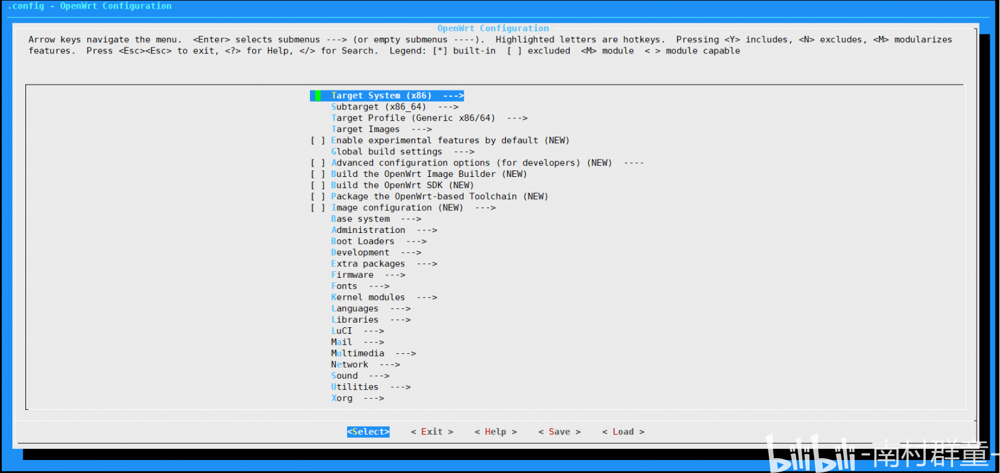
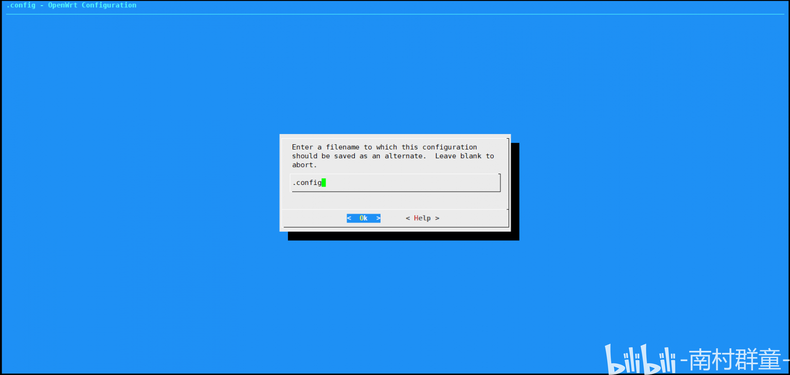

哪个男孩子不想拥有一份属于自己的定制化路由器固件呢？LEDE Open­wrt 是一套由大神 Lean 编写的稳定且更新很勤的固件，不需要太多的专业知识就可以定制化一套属于自己的路由器固件。网络上编译的教程很多，但大都鱼龙混杂，有的已经过时。于是总结了一下编译这一路踩下的坑，帮助后面的同学们能快速地学习。

<!--more-->

作者的 Github 仓库： [https://github.com/coolsnowwolf/lede](https://github.com/coolsnowwolf/lede)

----

1. 选择一个合适的用来编译的机器选择一个合适的用来编译的机器 

   如果你选择用本地机器进行编译，请准备好一个好的梯子（非常重要）。

2. 使用 GitHub Ac­tions（推荐）

   可以参考[作者博客](https://p3terx.com/archives/build-openwrt-with-github-actions.html)，作者的 [GitHub 仓库](https://github.com/P3TERX/Actions-OpenWrt)。

3. 使用 VPS 编译

   可以使用 [vultr.com](https://www.vultr.com/)，按小时计费，可保存镜像，编译后即可销毁停止计费，之后重新开启一个实例然后使用快照恢复即可（注：2021.10.1 后 vultr 会按照镜像大小进行收费）。

   1. 如果这篇文章对你有帮助，可以通过我的[购买链接](https://www.vultr.com/?ref=8912695-6G)注册账户，关联信用卡或 Pay­pal 后将获得 100 美元的额度（30 天有效）。
   2. 如果你选择 vultr 这家提供商，推荐选择 High Fre­quency，1 CPU，64G 即可（第一次编译推荐用单线程，多核 CPU 无用武之地而且更贵。

4. 注意事项

   1. 不要用 root 用户进行编译！！！

   2. 国内用户编译前最好准备好足够的能量值使用魔法

   3. 固件默认登陆 IP 192.168.1.1 密码 pass­word 装好 Ubuntu 64bit

   4. 推荐 Ubuntu 20.04 LTS x64 剩余磁盘空间推荐 40G 以上 至少要有 1G 的 RAM, 如果不足可以增加 swap 分区作为补充 [SWAP 虚拟内存一键配置脚本](https://www.moerats.com/archives/722/)

   5. 如果你使用 WSL 或 WSL2 进行编译： 

   由于 wsl 的 PATH 路径中包含带有空格的 Win­dows 路径，有可能会导致编译失败，请在将 **make -j1 V=s** 或 **make -j$(($(nproc) + 1)) V=s** 改为

   ```bash
   # 首次编译：
   PATH=/usr/local/sbin:/usr/local/bin:/usr/sbin:/usr/bin:/sbin:/bin make -j1 V=s
   # 二次编译：
   PATH=/usr/local/sbin:/usr/local/bin:/usr/sbin:/usr/bin:/sbin:/bin make -j$(($(nproc) + 1)) V=s
   ```

5. 安装必要组件

   ```bash
   sudo apt update && sudo apt upgrade sudo apt-get -y install build-essential asciidoc binutils bzip2 gawk gettext git libncurses5-dev libz-dev patch python3 python2.7 unzip zlib1g-dev lib32gcc1 libc6-dev-i386 subversion flex uglifyjs git-core gcc-multilib p7zip p7zip-full msmtp libssl-dev texinfo libglib2.0-dev xmlto qemu-utils upx libelf-dev autoconf automake libtool autopoint device-tree-compiler g++-multilib antlr3 gperf wget curl swig rsync
   ```

6. 下载源码

   ```bash
   git clone https://github.com/coolsnowwolf/lede && cd lede
   
   # PLUS: 如果你有某需求，请按下面方法操作
   # 修改lede目录下的 feeds.conf.default 文件
   nano ~/lede/feeds.conf.default
   # 加入下面这行
   src-git helloworld https://github.com/fw876/helloworld
   ```

   之后 ctrl+O 回车 ctrl+x 进行保存 

   **在之后编辑配置文件的时候请注意：某 V 开头的 core 与 X 开头的 core 不能共存，只能选择其中的一个。**

7. 定制固件

   1. 配置编译

      ```bash
      ./scripts/feeds update -a
      ./scripts/feeds install -a
      make menuconfig
      ```

   2. 然后你会看到这个界面

      

<center>（menuconfig，原图来源于本人账号）</center>

​		3. 我们需要根据路由器的 CPU 架构来选择前两项，请大家在这个清单里找到自己的 CPU 架构进行合适地修改：[https://ssr.tools/1366](https://ssr.tools/1366)

​		4. 路由管理界面的主题在这里进行修改：LuCI ——> Themes ，将喜欢的主题按 y 选中即可

​		5. 在 LuCI ——> Applications 中选择自己需要的插件，插件列表注释请见： [https://www.right.com.cn/forum/thread-344825-1-2.html](https://www.right.com.cn/forum/thread-344825-1-2.html)

   6. 保存配置

      通过左右键移动到 Save 选项，回车，进入如下的界面：

      

<center>（save，原图来源于本人账号）</center>

小tips：***建议先以别的文件名保存，然后通过 xftp 之类的软件将保存在 lede 文件夹下的配置文件保存到本地。下次编译的时候可以将本地的配置文件上传到 lede 文件夹下，下次 make menuconfig 时可以左右键选择 load，然后输入你的配置文件名载入配置文件。***

7. 下载 dl 库（国内请尽量全局使用魔法）

   ```bash
   make -j8 download V=s
   ```

8. 开始编译（-j1 后面是线程数。第一次编译推荐用单线程）

   ```bash
   make -j1 V=s
   ```

​		引用 lede 大神的话：

​		本套代码保证肯定可以编译成功。里面包括了 R21 所有源代码，包括 IPK 的。

------

当然编译过程中可能出现各种小问题，大部分的问题可以通过重新运行编译的命令来解决。

编译完成后输出路径在lede文件夹下的 bin/targets，编译过程到此结束，Enjoy Yourself！

如果你需要二次编译：

```bash
cd lede
git pull ./scripts/feeds update -a && ./scripts/feeds install -a make defconfig make -j8 download make -j$(($(nproc) + 1)) V=s
```

如果你需要修改配置：

```bash
cd lede
git pull ./scripts/feeds update -a && ./scripts/feeds install -a rm -rf ./tmp && rm -rf .config make menuconfig make -j$(($(nproc) + 1)) V=s
```

如果您遇到任何问题，都可以在下方评论，我会尽力帮助您。如果文章中有不足之处甚至纰漏也烦请您可以在评论区或私信进行斧正，我很乐意听到大家的意见哦！
