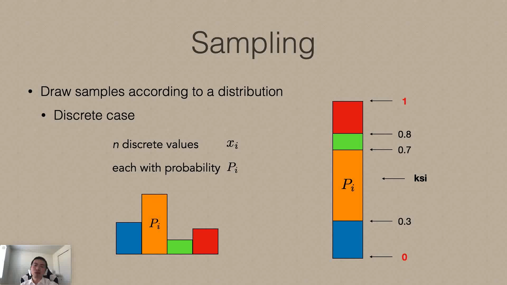
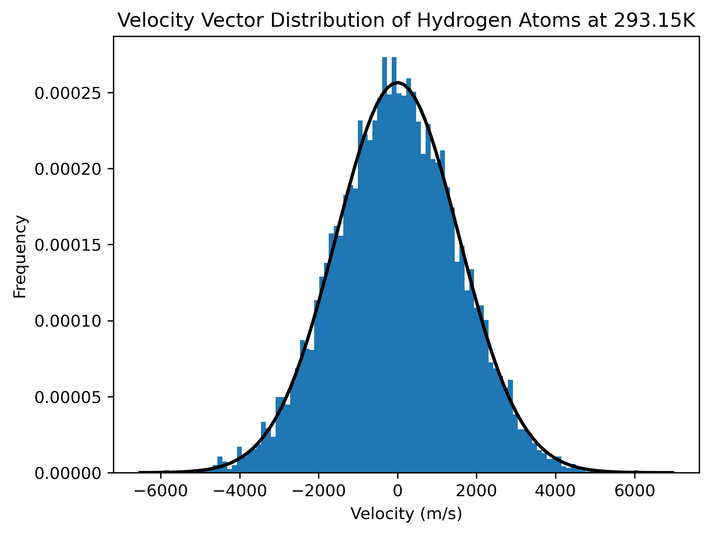

<!--more-->

## 背景资料

我们在[前文](https://diazepam.cc/post/xtb-initial-velocities)探讨了使用 [xTB](https://github.com/grimme-lab/xtb) 进行分子动力学模拟时的速度初始化问题。xTB 的速度初始化的正负性服从均匀分布，且相同类型原子的速度的绝对值相同，这可能并不符合实际情况。我们在本文探讨如何生成服从麦克斯韦-玻尔兹曼分布的速度初始化。

根据[Maxwell–Boltzmann distribution 结论的推导](https://en.wikipedia.org/wiki/Maxwell%E2%80%93Boltzmann_distribution)的 `Distribution for the velocity vector` 部分，**速度矢量**在**一个方向**的**概率密度函数**表达式为：
$$
f_{v} (v_{i} ) = \sqrt{\frac{m}{2\pi kT} } exp(\frac{-mv^{2} _{i} }{2kT} )
$$
可以看到速度矢量在一个方向的概率密度函数是正态分布的形式，其参数为：
$$
\mu = 0 \\
\sigma = \sqrt{\frac{kT}{m} }
$$
为了从概率密度函数推导出实际分子的速度矢量分布，应当根据速度矢量的概率密度函数（PDF）求得累积分布函数（CDF），再得到累计分布函数的反函数。在 [0, 1] 范围内生成随机变量，然后带入累计分布函数的反函数，就可以得到服从概率密度函数的分布。

这里有一张非常清晰地讲解逆变换采样的过程的图，摘自[2]：



但是由于速度矢量概率密度函数形式比较复杂，求其累积分布函数的反函数比较困难（有兴趣的小伙伴可以参考[这篇文章](https://allenwind.github.io/blog/10395/)）。幸好 SciPy 提供的 [scipy.stats.norm.ppf](https://docs.scipy.org/doc/scipy/reference/generated/scipy.stats.norm.html) 为我们提供了对正态分布的概率密度函数逆变换采样的方法。我们在下一个章节讨论如何用 Python 实现服从麦克斯韦-玻尔兹曼分布的速度初始化。

## 实践

### H 元素在 293.15K 的速度矢量分布图

```python
# Author: Heqi Liu
# GitHub: https://github.com/metaphorme
# Time: 4 April 2024
# Licensed under the MIT License.

from math import sqrt
import numpy as np
import scipy.stats as stats
from scipy.constants import Boltzmann
import matplotlib.pyplot as plt


# 设置随机种子以获得可重现的结果
np.random.seed(0)

# 生成 10000 个均匀分布的随机值
uniform_samples = np.random.uniform(0, 1, 10000)

# 请见公式（2）
loc = 0
sigma = sqrt(((Boltzmann * 293.15) / 1.6735575e-27))

# 使用逆变换采样生成服从高斯分布的样本
gaussian_samples = stats.norm.ppf(uniform_samples, loc=loc, scale=sigma)

# 绘制直方图
plt.hist(gaussian_samples, bins=100, density=True)

# 绘制高斯分布的 PDF
xmin, xmax = plt.xlim()
x = np.linspace(xmin, xmax, 100)
p = stats.norm.pdf(x, 0, sigma)
plt.plot(x, p, 'k', linewidth=2)

title = "Velocity Vector Distribution of Hydrogen Atoms at 293.15K"
plt.title(title)
plt.xlabel("Velocity (m/s)")
plt.ylabel("Frequency")

# 显示图形
plt.show()
```

获得美图一张：



### 对一组原子进行服从麦克斯韦-玻尔兹曼分布的速度初始化

```python
from math import sqrt
from typing import Union
import numpy as np
from rdkit import Chem
import scipy.stats as stats
from scipy import constants


def mb_initial_velocities(atom_list: Union[list, np.ndarray], t: Union[int, float], seed=None) -> np.ndarray:
    """
    mb_initial_velocities
    服从麦克斯韦-玻尔兹曼分布的速度初始化
    :param atom_list: Union[list, np.ndarray]，体系原子序数表
    :param t: Union[int, float]，初始温度
    :param seed: 随机种子
    :return: np.ndarray

    Author: Heqi Liu
    GitHub: https://github.com/metaphorme
    Time: 5 April 2024
    Licensed under the MIT License
    """

    if isinstance(atom_list, list):
        atom_list = np.array(atom_list)

    np.random.seed(seed)  # 设置随机种子

    # 初始化原子质量，单位：kg
    # 列表index索引代表第index个元素，第0个元素为0。
    atomic_number_atomic_mass = []
    for i in range(119):
        atomic_number_atomic_mass.append([Chem.Atom.GetMass(Chem.Atom(i)) * constants.physical_constants["atomic mass constant"][0]])
    atomic_number_atomic_mass = np.array(atomic_number_atomic_mass)

    atoms_velocities = dict()  # 原子: 速度分布字典
    uniform_samples = np.random.uniform(0, 1, 10000)  # 生成 10000 个均匀分布的随机值
    for atom in np.unique(atom_list):  # 去重原子列表
        sigma = sqrt(((constants.Boltzmann * t) / atomic_number_atomic_mass[atom].item()))
        velocities = stats.norm.ppf(uniform_samples, loc=0, scale=sigma)  # 使用逆变换采样生成服从高斯分布的速度
        atoms_velocities[atom] = velocities

    # 生成原子速度
    velocities = np.zeros((len(atom_list), 3), dtype=np.float64)
    for i in range(len(atom_list)):
        velocities[i] = np.random.choice(atoms_velocities[atom_list[i]], size=3, replace=True)  # 独立地抽取三个值作为速度矢量
    return velocities
```

我们试着初始化 O2C2H4 在 293.15K 时的初始速度：

```python
velocities = mb_initial_velocities(atom_list=[8, 8, 6, 6, 1, 1], t=293.15, seed=0)
print(velocities)
```

得到的初始速度为：

```
[[  -46.75525773   854.76847761   417.26670771]
 [  309.56764731  -558.42177725   -29.12528993]
 [ -387.6395438   -107.36729731   385.78401259]
 [ -758.71300473  -403.85757334   150.14948602]
 [ 2641.77710172  1915.01025137  -635.2587755 ]
 [-3392.80768016 -1217.41113537   581.3346014 ]]
```

大功告成！

## 参考文献

[1] Maxwell–Boltzmann distribution, [https://en.wikipedia.org/wiki/Maxwell%E2%80%93Boltzmann_distribution](https://en.wikipedia.org/wiki/Maxwell%E2%80%93Boltzmann_distribution)

[2] 渲染与采样（1）：逆变换采样（Inverse Transform Sampling）—原理与实际应用, [https://zhuanlan.zhihu.com/p/622443806](https://zhuanlan.zhihu.com/p/622443806)

[3] 采样（二）：从正态分布采样, [https://allenwind.github.io/blog/10395/](https://allenwind.github.io/blog/10395/)

## 特别鸣谢

感谢 [TimeCrystal](https://github.com/ytawm) 为问题的解决提供了方向和理论支撑。
