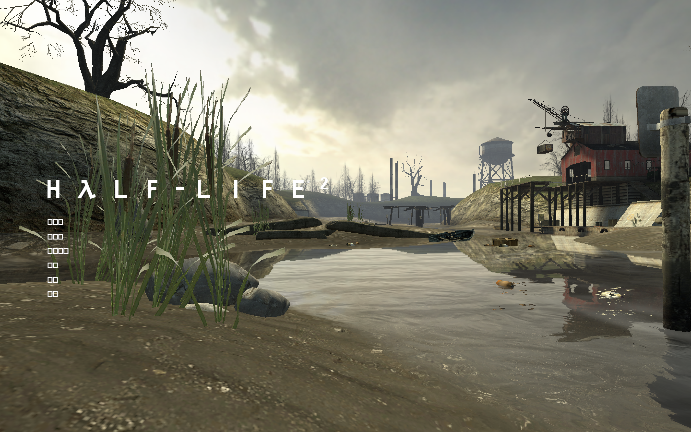
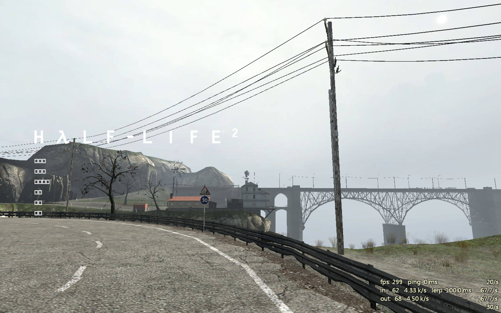
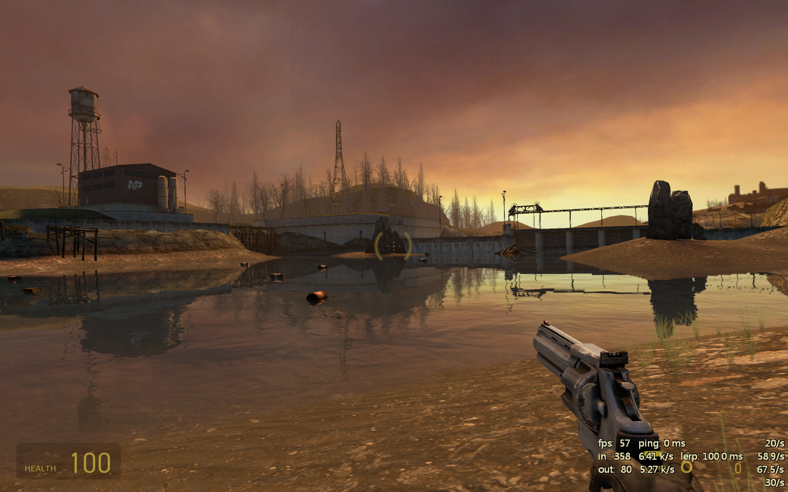
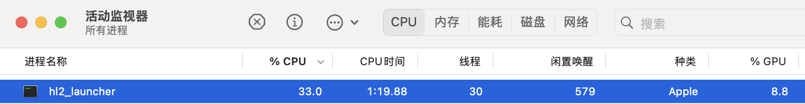

越到考试，奇怪的想法越多。

<!--more-->

作为半条命系列的狂热粉丝，加之考研复习的无聊，遂尝试在自己的 M1 上运行半条命2。

印象中的 Source Engine 只有 32 位版本，更不要提 ARM 架构支持、多平台支持了。由于其源代码 TF2 2018 版本泄漏，加上社区的支持和热情，我有幸看到了支持多架构、多平台、易于编译的[起源引擎](https://github.com/nillerusr/source-engine)。这篇文章将引导您编译引擎、安装游戏文件和游玩游戏，并填补项目 wiki 缺少的部分。

项目仓库：[https://github.com/nillerusr/source-engine](https://github.com/nillerusr/source-engine)

## 准备环境和编译引擎

请参考[最新文档](https://github.com/nillerusr/source-engine/wiki/Source-Engine-(EN))，并以此为补充。

### 准备环境

* 安装 Xcode build tools

  ```bash
  xcode-select --install
  ```

* 安装 [HomeBrew](https://brew.sh/)

* 安装依赖

  ```bash
  brew install sdl2 freetype2 fontconfig pkg-config opus libpng libedit
  ```

### 编译引擎

1. 克隆源代码

   ```bash
   # 克隆源代码并切换目录
   git clone --recursive --depth 1 https://github.com/nillerusr/source-engine.git
   cd source-engine
   ```

2. 创建编译脚本

   在 source-engine 目录下创建以下脚本 build.sh：

   ```bash
   #!/bin/zsh
   
   platform="mac"  # 平台名，仅用于文件夹命名
   arch="aarch64"  # 架构，仅用于文件夹命名
   
   # 需要编译的引擎类型
   # 参考：https://gist.github.com/tifasoftware/971697061ffcf783807887795d7406df
   # hl2       ->  半条命2
   # episodic  ->  半条命2：第一章、半条命2：第二章（我没有测试）
   # hl1       ->  可能是半条命：起源（我没有测试）
   # portal    ->  传送门（我没有测试）
   games=("hl2" "episodic" "hl1" "portal")
   
   # 编译引擎
   for build_game in "${games[@]}"; do
       echo "Building and installing $build_game for $platform on $arch..."
   
       python3 waf configure -T release --prefix='' --build-games="$build_game"
       if [ $? -ne 0 ]; then
           echo "Configuration failed for $build_game"
           exit 1
       fi
   
       python3 waf build
       if [ $? -ne 0 ]; then
           echo "Build failed for $build_game"
           exit 1
       fi
   
       python3 waf install --destdir="../source-engine-${build_game}-${platform}-${arch}"
       if [ $? -ne 0 ]; then
           echo "Install failed for $build_game"
           exit 1
       fi
   
       echo "$build_game build and install completed successfully."
   done
   ```

3. 执行脚本

   ```bash
   sh build.sh
   ```

4. 之后，你可以在 source-engine 目录的前一个目录看到编译好的引擎。

## 安装游戏文件

此步骤文档中没有，不确定每一步都正确。我仅测试 Half-Life 2 的游戏文件安装。

1. 下载游戏文件

   去 [Steam 的 Half-Life 2 页面](https://store.steampowered.com/app/220/HalfLife_2/)购买和下载 Half-Life 2。这里我是在 Windows 的 Steam 下载的 Half-Life 2，然后导入 Mac 的（因为不想养成在 Mac 上玩游戏的坏习惯，所以不想下载 Steam。但是据说 Mac 版 Steam 能下载 32 位 Mac 版本，我没有测试）。

2. 导入文件

   在 Steam 的 Half-Life 2 页面，点击齿轮 -> 管理 -> 浏览本地文件，打开游戏文件位置，复制一个副本。

   将编译好的引擎文件夹中 `bin`、`hl2` 文件夹的内容复制到副本的相应文件夹下。将 `hl2_launcher` 复制到副本的根目录下。

## 开始玩！

在副本的根文件夹下打开 Terminal，然后执行 `./hl2_launcher`。





可以进入并游玩，但中文无法正常显示。



游戏内 300 帧，但实际玩起来还是觉得有些卡顿和发热。



正常使用 CPU 和 GPU，ARM 架构。GPU 占用率低是因为截图的时候在游戏开始界面。

## 懒人专用

好吧，看起来你非常的懒惰，所以我编译好了 ARM 架构 macOS 的 Source Engine。你可以在遵循当地法律法规的前提下从[这里](https://1drv.ms/f/c/bcb0c1f78aa2a26d/EmWnVqmX-o5NjR4wgNV0Q4wBpaP4KGjbgs87D1t_t-ywpg?e=tQ3jxh)下载引擎并**自行安装游戏文件**试玩，本人不承担任何责任。

至于游戏文件？请你务必购买正版哦！

```bash
$ git log --pretty=format:'%H' -n 1
29985681a18508e78dc79ad863952f830be237b6
(END)

$ shasum -a 256 *.tar.xz
4c5d0b66115edf90f5d25aaccf67b9051c81d3f98e8168cb6e8da4684ec10081  source-engine-episodic-mac-aarch64.tar.xz
5522bbca1376095963326905562c5eb2a416454dfe8c6be623a0d2647bc3a7db  source-engine-hl1-mac-aarch64.tar.xz
f323398d42ef1dbc40044a483c2bc59e082b0242fccece891abe411e02a466f0  source-engine-hl2-mac-aarch64.tar.xz
20df9dfab6b98910dfe2f815b30a225a72c7256da0a702f5e5b42031f4bddba1  source-engine-portal-mac-aarch64.tar.xz
```

## 参考

[1] [Source Engine (EN), nillerusr](https://github.com/nillerusr/source-engine/wiki/Source-Engine-(EN))

[2] [Building Source Engine for Apple Silicon, tifasoftware](https://gist.github.com/tifasoftware/971697061ffcf783807887795d7406df)

